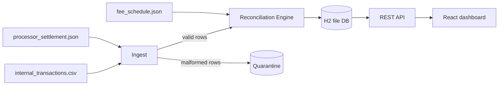

# Settlement Reconciliation — Implementation Plan

This is the plan approved before coding started. Kept here so reviewers can see the approach up front, not only the finished app.

## Stack and layout

- **Backend:** Java 21, Spring Boot 3 (Maven), Spring Data JPA, **H2 in file mode** (zero-setup persistence that survives restarts). Amounts handled as `BigDecimal` everywhere — never floats.
- **Frontend:** React + Vite + TypeScript (strict, type-checked build), small compartmentalized components, console logging on every UI action.
- Repo layout: `backend/` and `frontend/` folders alongside the provided `data/`, `test/`, `fee_schedule.json`.

## 1. Ingest and quarantine

- Parsers for the CSV (internal ledger) and JSON array (settlement). Each row is validated structurally: required fields present, amount parses as a decimal, currency is `USD`, card type is a known enum, dates parse. Failures go to a `quarantined_row` table with the raw row and the reason — they never enter reconciliation and never count as breaks (test set has exactly 5: 3 internal + 2 settlement).
- Validation is type-driven (parse into typed domain records), not pattern matching.

## 2. Fee engine (pure, unit-tested)

From `fee_schedule.json`:

- `interchange = round_half_up(gross × pct + flat)` and `processor = round_half_up(gross × 0.003 + 0.05)` — **each fee rounded to the cent independently**, then `expected_net = gross − interchange − processor`.
- Refunds: expected settlement is full negative gross, **no fees**.

## 3. Matching engine (distinct, testable module — no Spring dependencies)

Passes, in order:

1. **Orphan refund pass (ledger-only, runs first):** any internal REFUND whose `merchant_ref` matches no internal SALE is flagged as an orphan-refund break, even if it settles cleanly.
2. **Primary match by `merchant_ref` + sign/type:** positive settlements pair with SALEs, negative with REFUNDs sharing the ref (refunds reuse the sale's ref, so sign disambiguates).
3. **Fallback for blank `merchant_ref`:** candidate key = `merchant_id + card_type + card_last4`, comparing `settled_amount` against the candidate sale's **fee-adjusted expected net** (±$0.01 tolerance), preferring candidates inside the settlement date window.
4. **Multi-row resolution per internal txn:** rows that each *repeat* the expected net → **duplicate settlement**; rows that *sum* to the expected net → **split settlement** (bonus, handled so splits are never miscounted as duplicates).

## 4. Break classification (per matched pair)

- **Amount mismatch:** `settled ≠ gross − reported_interchange − reported_processor_fee` beyond tolerance (principal itself is wrong).
- **Fee discrepancy:** settled *is* internally consistent with reported fees, but reported fees deviate from the schedule.
- **Wide-window timing:** amounts and fees correct, but settled outside `captured_at + 1..3 days` — reported as its own category (matches EXPECTED.md's treatment).
- Leftovers become **unmatched-internal** / **unmatched-settlement**.

**Documented open-question calls:** tolerance = ±$0.01 absolute (absorbs sub-cent reconstruction drift); wide-window rows still match but are flagged on their own line; splits accepted when parts sum to expected net within tolerance.

## 5. Persistence and API

- Entities: `ImportRun` (idempotent re-imports via file content hash — bonus), `InternalTransaction`, `SettlementRecord`, `QuarantinedRow`, `ReconciliationResult` (match status, break category, both side references, reason text).
- Endpoints roughly: `POST /api/imports` (upload/trigger + reconcile), `GET /api/runs/{id}/summary`, `GET /api/runs/{id}/breaks` (filterable by category), `GET /api/runs/{id}/merchants`, `GET /api/runs/{id}/quarantine`.

## 6. React dashboard (ops-usable)

- **Summary view:** count + dollar total per category, cleanly-matched count, expected payout vs. actual settled with total discrepancy, total fees deducted.
- **Per-merchant rollup table.**
- **Break drill-down:** filterable list; each break shows both sides side-by-side (where they exist) with the human-readable reason.
- Components split per view (no monoliths); every user action logged to console.

## 7. Tests and validation

- Unit tests: fee math (rounding edge cases per card type), each matching pass, duplicate-vs-split disambiguation, classification rules.
- **Integration test against `test/`:** run the full pipeline and assert every count and money check in `test/EXPECTED.md` exactly (8 clean, 1 of each break, 5 quarantined; gross 6804.12, refunds −1557.02, settled 5161.00, fees 151.74).
- Then run against `data/` end-to-end via the UI.

## 8. Docs and submission prep

- Rewrite `README.md` with setup/run instructions (backend + frontend), the decisions on the three open questions, tradeoffs, and known gaps.
- Fill in `PROMPTS.md` for LLM usage.
- Meaningful commit history as work lands, not one dump at the end.
